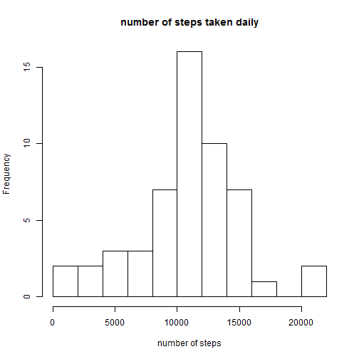

# Reproducing Research Assignment 1

## Introduction

It is now possible to collect a large amount of data about personal movement using activity monitoring devices such as a Fitbit, Nike Fuelband, or Jawbone Up. These type of devices are part of the "quantified self" movement -- a group of enthusiasts who take measurements about themselves regularly to improve their health, to find patterns in their behavior, or because they are tech geeks. But these data remain under-utilized both because the raw data are hard to obtain and there is a lack of statistical methods and software for processing and interpreting the data.

This assignment makes use of data from a personal activity monitoring device. This device collects data at 5 minute intervals through out the day. The data consists of two months of data from an anonymous individual collected during the months of October and November, 2012 and include the number of steps taken in 5 minute intervals each day.


## Data

The data for this assignment can be downloaded from the course web site:

Dataset: Activity monitoring data [52K]
The variables included in this dataset are:

steps: Number of steps taking in a 5-minute interval (missing values are coded as NA)

date: The date on which the measurement was taken in YYYY-MM-DD format

interval: Identifier for the 5-minute interval in which measurement was taken

The dataset is stored in a comma-separated-value (CSV) file and there are a total of 17,568 observations in this dataset.

## Assignment


### Loading and preprocessing the data


```r
act <- read.csv("activity.csv")
```

```
## Warning in file(file, "rt"): cannot open file 'activity.csv': No such file
## or directory
```

```
## Error in file(file, "rt"): cannot open the connection
```

```r
act$date <- as.Date(act$date)
p <- as.POSIXct(as.Date(act$date))
d <- unclass(as.POSIXlt(act$date))
act$yday <- d$yday
```

## What is mean total number of steps taken per day?


```r
steps_dist <- tapply(act$steps, act$yday, sum)
```
1. Make a histogram of the total number of steps taken each day


```r
hist(steps_dist, breaks = 10, main = "number of steps taken daily", xlab = "number of steps")
```



```r
summary(steps_dist)
```

```
##    Min. 1st Qu.  Median    Mean 3rd Qu.    Max.    NA's 
##      41    8841   10760   10770   13290   21190       8
```

2. Calculate and report the mean and median total number of steps taken per day


The mean and median total steps taken per day are1.076 &times; 10<sup>4</sup> and 1.077 &times; 10<sup>4</sup>respectively.


##What is the average daily activity pattern?
1. Make a time series plot (i.e. type = "l") of the 5-minute interval (x-axis) and the average number of steps taken, averaged across all days (y-axis)


```r
mean_steps <- tapply(act$steps, act$interval, mean, na.rm = TRUE)
plot(mean_steps,type ="l")
abline(h=206.1698, col ="blue")
abline(v=105, col = "blue")
```


2. Which 5-minute interval, on average across all the days in the dataset, contains the maximum number of steps?


```r
mean_steps[mean_steps>200]
```

```
##      835 
## 206.1698
```

```r
head(dimnames(mean_steps)[[1]],14)
```

```
##  [1] "0"   "5"   "10"  "15"  "20"  "25"  "30"  "35"  "40"  "45"  "50" 
## [12] "55"  "100" "105"
```

```r
maxpos <- sum(as.numeric(dimnames(mean_steps)[[1]])<=835)
maxpos
```

```
## [1] 104
```

```r
max <- mean_steps[[maxpos]]
max
```

```
## [1] 206.1698
```

The 5-minumte interval is at 104th;i.e. 08:35 hr;  it contains the maximum average 5-mins steps at 206.1698113


##Imputing missing values

1. Calculate and report the total number of missing values in the dataset (i.e. the total number of rows with NAs)


```r
sum(is.na(act$steps))
```

```
## [1] 2304
```

2. Devise a strategy for filling in all of the missing values in the dataset. The strategy does not need to be sophisticated. For example, you could use the mean/median for that day, or the mean for that 5-minute interval, etc.

* Step 1:determine which element of original dataframe is 'NA' in the for-loop, 
* Step 2:determine the 5-minutes interval it falls under. 
* Step 3: The 'NA' is then replaced by the average steps computed above for that particular interval period.


3. Create a new dataset that is equal to the original dataset but with the missing data filled in.

```r
for(i in 1:length(act$steps)) 
  {
    if (is.na(act$steps[i])) ## which element 'i'  of original dataframe
    {act$steps[i] <- mean_steps[as.character(act$interval[i])] ## replace 'NA' based on that interval
     }
}
```

4. Make a histogram of the total number of steps taken each day and Calculate and report the mean and median total number of steps taken per day. Do these values differ from the estimates from the first part of the assignment? What is the impact of imputing missing data on the estimates of the total daily number of steps?


```r
steps_dist <- tapply(act$steps, act$yday, sum)
hist(steps_dist, breaks = 10, main = "number of steps taken daily",xlab = "number of steps", ylim = c(0,25))
```


```r
summary(steps_dist)
```

```
##    Min. 1st Qu.  Median    Mean 3rd Qu.    Max. 
##      41    9819   10770   10770   12810   21190
```


The mean and median total steps taken per day are1.077 &times; 10<sup>4</sup> and 1.077 &times; 10<sup>4</sup>respectively. Compared to the earlier plot, there is no difference in the mean, but a slight increase in the median. There is a signficant increase in the frequency of the median.

##Are there differences in activity patterns between weekdays and weekends?

1. Create a new factor variable in the dataset with two levels -- "weekday" and "weekend" indicating whether a given date is a weekday or weekend day.


```r
act$wday<- weekdays(p)
for (i in 1:length(act$steps))
  {
    if(act$wday[i]=="Saturday"|act$wday[i]=="Sunday")
      {
          act$day[i] <- "weekend"
      } else  
      {
          act$day[i] <- "weekday"
      }
}

table(act$day)
```

```
## 
## weekday weekend 
##   12960    4608
```

2. Make a panel plot containing a time series plot (i.e. type = "l") of the 5-minute interval (x-axis) and the average number of steps taken, averaged across all weekday days or weekend days (y-axis). The plot should look something like the following, which was created using simulated data:


```r
act_split <- split(act, act$day)
ave_steps_weekday <- with(act_split$weekday,tapply(steps, interval, mean))
ave_steps_weekday <- data.frame(ave = ave_steps_weekday, interval = as.numeric(dimnames(ave_steps_weekday)[[1]]),day="weekday")
ave_steps_weekend <- with(act_split$weekend,tapply(steps, interval, mean))
ave_steps_weekend <- data.frame(ave = ave_steps_weekend, interval = as.numeric(dimnames(ave_steps_weekend)[[1]]),day="weekend")
ave_steps <- rbind(ave_steps_weekend,ave_steps_weekday)

library(lattice)
y<- ave_steps$ave
x<- ave_steps$interval
f<-ave_steps$day
xyplot(y~x|f, layout=c(1,2), type="l", xlab = "5-minutes Interval", ylab = "Number of Steps")
```


The daily pattern is similar. Weekdays see much higher steps at the peak at 8:00 hr that go above 200 steps whereas weekends fall below 200 steps. Weekends see higher average actvities for rest of the day.
